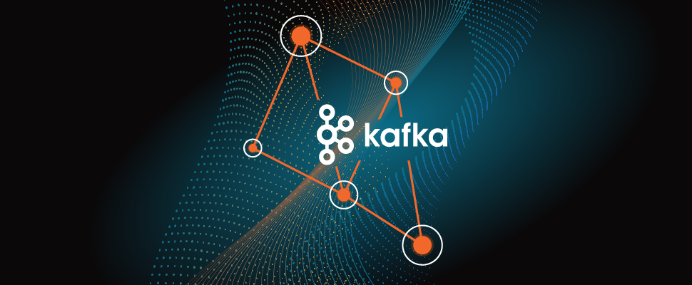

# Kafka Zero To Pro 

 

### ⛏️ ***"A stone is broken by the last stroke of the hammer. This does not mean that the first stroke was useless. Success is the result of continuous effort."*** ⛏️

 

This guide will be running `Kafka` locally in `WSL2` running `Ubuntu-22.04`

 

## ***Table*** *of* ***`Contents`*** 📜

* 🗃️ [***resources***](00-resources/README.md)
* 💡 [***theories***](01-kafka-theory/README.md)
* 👩‍💻 [***cli 101***](02-cli-101/README.md)
* 🐍 [***programming***](03-kafka-programming/README.md)

 

## **Kafka** `Architecture` 🏗️

`Kafka` is a distributed streaming platform. It is used to publish and subscribe to streams of records, similar to a message queue or enterprise messaging system. `Kafka` is used for building *real-time data pipelines* and *streaming apps*. It is **horizontally scalable**, **fault-tolerant**, **wicked fast**, and runs in production in **thousands of companies**.

***Use cases include***

* **`real-time analytics`** (e.g. clickstreams, ad impressions, IoT telemetry)
* **`messaging systems`** (e.g. activity feeds, alert notifications, **`stream processing`**)
* **`activity tracking`** (e.g. GPS location, user behavior)
* **`stream processing`** (e.g. fraud detection, anomaly detection, real-time alerting)
* **`decoupling microservice`** (e.g. service oriented architecture)
* **`microservices pub/sub`** (e.g. event-driven architecture)

`Kafka` only accepts bytes as an input from producers and sends bytes out as an output to consumers. Messages are serialized and deserialized by the producer and consumer respectively. This allows `Kafka` to be used with any programming language. Serialization and deserialization is used only on keys and values.

 

<!-- 
## **Basic** `Commands` 📝

*  

-->